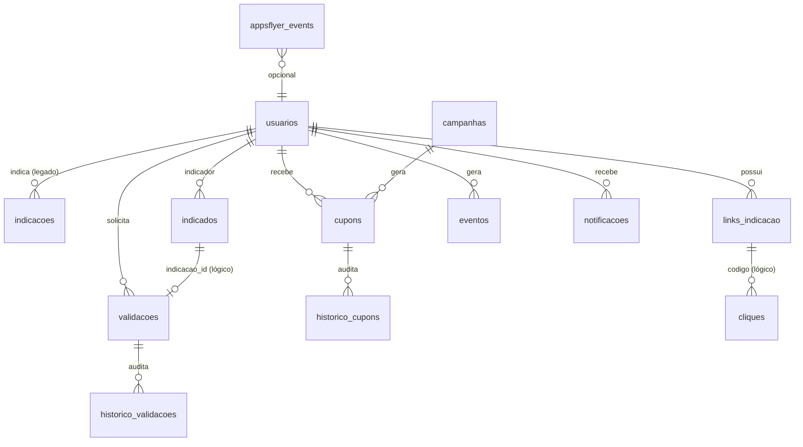

# DATABASE_REPORT.md — Indique e Ganhe

**Data:** 26/06/2026  
**Fase:** 0 — Diagnóstico  
**Fonte:** Análise de `database/*.sql` + models PHP

---

## 1. Configuração de conexão

### Classe Database (`config/database.php`)

Suporta variáveis duplas por compatibilidade:

| Env produção | Env local alternativo |
|--------------|----------------------|
| DB_HOST | DB_HOST |
| DB_PORT | DB_PORT |
| DB_DATABASE | DB_NAME |
| DB_USERNAME | DB_USER |
| DB_PASSWORD | DB_PASS |

PDO: `utf8mb4`, `ERRMODE_EXCEPTION`, `EMULATE_PREPARES=false`.

### Estado da migração de banco

| Parâmetro | Atual (.env) | Alvo |
|-----------|--------------|------|
| Host | localhost | localhost |
| Porta | 3306 | 3306 |
| Database | u146248277_indicacao | ✅ Configurado (Fase 1.1) |
| Username | u146248277_indiqueganhe | ✅ Configurado (Fase 1.1) |
| Password | *(configurado no servidor)* | *(configurar no .env — não documentar)* |

**Status:** Configuração **não migrada** — código suporta via .env; pendente atualização no deploy.

---

## 2. Inventário de migrations

| Arquivo | Etapa | Conteúdo |
|---------|-------|----------|
| schema.sql | 1 | CREATE DATABASE local |
| schema.hostinger.sql | 1 | Placeholder Hostinger |
| migration_etapa2.sql | 2 | usuarios, senha_recuperacao, login_tentativas |
| migration_etapa3.sql | 3 | indicacoes (v1) |
| migration_etapa4.sql | 4 | indicacoes (v2 — DROP/recreate) |
| migration_etapa5.sql | 5 | links_indicacao, cliques |
| migration_etapa6.sql | 6 | validacoes (v1), notificacoes |
| migration_etapa7.sql | 7 | campanhas (v1), eventos_indicacao |
| migration_etapa8.sql | 8 | indicados |
| migration_etapa9.sql | 9 | eventos |
| migration_etapa9_fix.sql | 9 | FK eventos |
| migration_etapa10.sql | 10 | validacao_indicacoes |
| migration_etapa12.sql | 12 | campanhas (v2 — schema expandido) |
| migration_etapa13.sql | 13 | validacoes (v2), historico_validacoes |
| migration_etapa14.sql | 14 | cupons, historico_cupons |
| migration_etapa15.sql | 15 | api_logs |
| migration_etapa16.sql | 16 | appsflyer_events |
| migration_add_soft_delete.sql | — | usuarios.ativo, deleted_at |
| migration_fix_indicados.sql | — | indicados (variante FK) |
| migration_etapa9_fix.sql | — | Idempotência FK |

**Ordem de execução recomendada:** 2 → 3 → 4 → 5 → 6 → 7 → 8 → 9 → 9_fix → 10 → 12 → 13 → 14 → 15 → 16 → soft_delete

---

## 3. Mapa de tabelas (schema efetivo esperado)

### 3.1 usuarios

| Coluna | Tipo | Constraints |
|--------|------|-------------|
| id | INT UNSIGNED PK AI | |
| nome | VARCHAR(150) NOT NULL | |
| cpf | CHAR(11) NOT NULL | UNIQUE |
| telefone | VARCHAR(20) NOT NULL | UNIQUE |
| email | VARCHAR(180) NOT NULL | UNIQUE |
| senha_hash | VARCHAR(255) NOT NULL | |
| aceite_lgpd | TINYINT(1) | |
| codigo_indicador | VARCHAR(10) NOT NULL | UNIQUE |
| cupom_recebido | TINYINT(1) | |
| whatsapp | VARCHAR(20) NOT NULL | |
| remember_token | VARCHAR(100) NULL | |
| ativo | TINYINT(1) DEFAULT 1 | soft delete migration |
| deleted_at | DATETIME NULL | soft delete migration |
| created_at, updated_at | TIMESTAMP | |

**Relacionamentos:** FK target de senha_recuperacao, indicacoes, links, validacoes, notificacoes, eventos, indicados, cupons.

---

### 3.2 senha_recuperacao

| Coluna | Tipo | FK |
|--------|------|-----|
| id | PK | |
| usuario_id | INT UNSIGNED | → usuarios.id CASCADE |
| token_hash | CHAR(64) | |
| expires_at | DATETIME | |
| used_at | DATETIME NULL | |

**Índices:** usuario_id, token_hash

---

### 3.3 login_tentativas

Rate limiting login.

| Coluna | Tipo |
|--------|------|
| chave | VARCHAR(128) UNIQUE |
| tentativas | INT |
| bloqueado_ate | DATETIME NULL |

---

### 3.4 indicacoes (LEGADO — etapas 3–4)

| Coluna | Tipo | Notas |
|--------|------|-------|
| id | PK | |
| usuario_id | FK → usuarios | |
| codigo_indicador | VARCHAR(10) | |
| codigo_referencia | VARCHAR(20) NULL | |
| status | ENUM | AGUARDANDO, LINK_ACESSADO, CADASTRO_PENDENTE, VALIDADO, PREMIO_LIBERADO, INVALIDO, EXPIRADO |
| origem | VARCHAR(50) | |
| premio_liberado | TINYINT | |
| nome_indicado, telefone_indicado | NULL | |

**Uso atual:** ReferralService, AdminController count — **coexiste com indicados**

---

### 3.5 indicados (PRIMÁRIO — etapa 8+)

| Coluna | Tipo | Constraints |
|--------|------|-------------|
| id | PK | |
| codigo_indicador | VARCHAR(10) | INDEX |
| usuario_indicador_id | INT UNSIGNED | FK → usuarios (SET NULL ou CASCADE) |
| nome | VARCHAR(150) NOT NULL | |
| cpf | CHAR(11) NOT NULL | UNIQUE |
| telefone | VARCHAR(20) NOT NULL | UNIQUE |
| email | VARCHAR(180) NOT NULL | UNIQUE |
| senha_hash | VARCHAR(255) NULL | |
| status | ENUM | LINK_ACESSADO → INVALIDADO |
| origem | VARCHAR(255) NULL | |
| aceite_lgpd | TINYINT | |

**Campos esperados pela API KOBE (NÃO na migration):**
- customer_id_vtex, appsflyer_id, tipo_evento, plataforma, motivo

**Gap:** ApiIndicacaoController assume colunas inexistentes.

---

### 3.6 links_indicacao

| Coluna | Tipo | Constraints |
|--------|------|-------------|
| id | PK | |
| usuario_id | INT UNIQUE | FK → usuarios |
| codigo | VARCHAR(10) UNIQUE | |
| slug | VARCHAR(20) UNIQUE | |
| url | VARCHAR(255) | **URL absoluta persistida** |
| cliques | INT DEFAULT 0 | |
| appsflyer_enabled | TINYINT | etapa 5 |

**Migração domínio:**
```sql
UPDATE links_indicacao
SET url = REPLACE(url, 'https://indique.nexden.com.br', 'https://indique.minasmaisdrogarias.com.br');
```

---

### 3.7 cliques

| Coluna | Tipo |
|--------|------|
| codigo | VARCHAR(10) INDEX |
| ip | VARCHAR(45) |
| user_agent | VARCHAR(255) |
| created_at | TIMESTAMP |

Sem FK para links_indicacao (referência lógica por codigo).

---

### 3.8 campanhas — CONFLITO DE SCHEMA

**Etapa 7 (legado):** nome, ativa, inicio, fim, cupom_indicado, status (RASCUNHO/ATIVA/PAUSADA/FINALIZADA)

**Etapa 12 (atual — model Campanha):**

| Coluna | Tipo |
|--------|------|
| nome, slug UNIQUE | |
| descricao TEXT | |
| status | ATIVA, INATIVA, AGENDADA, FINALIZADA |
| desconto, tipo_desconto | PERCENTUAL/VALOR_FIXO |
| valor_minimo_compra | |
| limite_indicacoes_usuario | |
| inicio, fim DATE | |
| banner, cor_primaria, cor_secundaria | |
| texto_botao, texto_landing | |

**Risco:** Se etapa 7 executada sem 12, model quebra. `CREATE TABLE IF NOT EXISTS` na 12 **não altera** tabela existente.

---

### 3.9 validacoes — CONFLITO DE SCHEMA

**Etapa 6 (legado):** usuario_id, cpf_indicado, telefone_indicado, status (inclui BENEFICIO_LIBERADO)

**Etapa 13 (atual — model Validacao):**

| Coluna | Tipo |
|--------|------|
| indicacao_id | INT NOT NULL |
| usuario_id | INT NOT NULL |
| status | PENDENTE, EM_ANALISE, VALIDADO, INVALIDADO, CANCELADO |
| motivo TEXT | |
| validado_em TIMESTAMP NULL | |

Sem FK declarada para indicacao_id / usuario_id na migration 13.

---

### 3.10 validacao_indicacoes (etapa 10 — paralelo)

Motor alternativo com flags: possui_app, cadastro_concluido, primeiro_acesso, elegivel, beneficio_disponivel.

**Status:** Model `ValidacaoIndicacao` existe; ValidationService usa `validacoes` etapa 13 — **tabela possivelmente órfã**.

---

### 3.11 historico_validacoes

Auditoria de transições de status em validacoes.

FK lógica: validacao_id (sem constraint na migration).

---

### 3.12 cupons / historico_cupons

**cupons:**

| Coluna | Tipo |
|--------|------|
| codigo | VARCHAR(20) UNIQUE |
| usuario_id, indicacao_id, campanha_id | INT |
| tipo, valor | |
| status | DISPONIVEL, RESERVADO, UTILIZADO, EXPIRADO, CANCELADO |
| origem, validade, utilizado_em | |

**historico_cupons:** status_anterior, status_novo, descricao, usuario_admin

---

### 3.13 notificacoes

usuario_id FK, tipo (informacao/sucesso/alerta), mensagem, link, lida.

---

### 3.14 eventos_indicacao (legado)

usuario_id FK, evento VARCHAR(50), dados TEXT (JSON).

Usado por IndicadosController.

---

### 3.15 eventos (etapa 9 — EventLogger)

| Coluna | Tipo |
|--------|------|
| usuario_id | NULL allowed, FK SET NULL |
| evento | VARCHAR(50) |
| referencia | VARCHAR(100) |
| payload | TEXT |

**Índices:** usuario_id, evento, referencia, created_at

---

### 3.16 api_logs (etapa 15)

endpoint, payload, response, ip, status_code, created_at.

---

### 3.17 appsflyer_events (etapa 16)

| Coluna | Tipo |
|--------|------|
| usuario_id, indicacao_id | NULL |
| appsflyer_id | VARCHAR(255) |
| event_name, event_value | |
| install_type | ENUM |
| media_source, campaign, campaign_id | |
| af_status | PENDING → INVALID |
| platform, raw_payload | |

Sem FKs declaradas.

---

## 4. Diagrama ER simplificado (relacionamentos principais)



---

## 5. Índices — resumo

| Tabela | Índices notáveis |
|--------|------------------|
| usuarios | UNIQUE cpf, telefone, email, codigo_indicador; idx ativo |
| indicados | UNIQUE cpf, email, telefone; idx codigo, status |
| indicacoes | idx usuario, codigo, status, telefone |
| links_indicacao | UNIQUE usuario, codigo, slug |
| cliques | idx codigo, ip, created_at |
| validacoes | idx indicacao, usuario, status, validado_em |
| cupons | UNIQUE codigo; idx usuario, indicacao, campanha, status |
| eventos | idx usuario, evento, referencia, created_at |
| appsflyer_events | idx appsflyer_id, status, created_at |

---

## 6. Campos / tabelas potencialmente não utilizados

| Item | Evidência |
|------|-----------|
| `usuarios.cupom_recebido` | Poucas referências no código |
| `indicacoes` (tabela inteira) | Legado; dashboard ainda consulta |
| `validacao_indicacoes` | Model existe; service usa validacoes v2 |
| `eventos_indicacao` | Paralelo a eventos |
| `campanhas.ativa` (v1) | Substituído por status enum v2 |
| `notificacoes` | Controller existe; UX limitada |
| `links_indicacao.slug` | Gerado; uso em rotas não implementado |
| `links_indicacao.appsflyer_enabled` | Sem lógica ativa |

---

## 7. Tabelas duplicadas / sobrepostas

| Domínio | Tabela A | Tabela B | Recomendação |
|---------|----------|----------|--------------|
| Indicações | indicacoes | indicados | Migrar → indicados |
| Eventos | eventos_indicacao | eventos | Migrar → eventos |
| Validação | validacao_indicacoes | validacoes | Deprecar validacao_indicacoes |
| Campanhas | schema v1 | schema v2 | ALTER ou recreate controlado |

---

## 8. Constraints ausentes (dívida)

Tabelas etapa 13–16 sem FOREIGN KEY:

- validacoes.indicacao_id
- cupons.usuario_id, indicacao_id, campanha_id
- historico_validacoes.validacao_id
- historico_cupons.cupom_id
- appsflyer_events.usuario_id, indicacao_id

**Risco:** Registros órfãos após deletes.

---

## 9. Script de provisionamento — banco novo Hostinger

Para `u146248277_indicacao`:

1. Selecionar banco no phpMyAdmin (CREATE DATABASE não permitido em shared hosting)
2. Executar migrations na ordem da seção 2
3. Verificar schema campanhas/validacoes corresponde aos models (etapa 12/13)
4. Executar migration_add_soft_delete.sql
5. Criar usuário admin manualmente (email admin@minasmais.com.br) — senha via bcrypt
6. Opcional: importar dados do banco antigo + UPDATE domínio em links_indicacao

**Não incluir senhas neste documento.**

---

## 10. Queries de diagnóstico pós-deploy

```sql
-- Verificar tabelas
SHOW TABLES;

-- Contagem registros core
SELECT 'usuarios' t, COUNT(*) c FROM usuarios
UNION SELECT 'indicados', COUNT(*) FROM indicados
UNION SELECT 'indicacoes', COUNT(*) FROM indicacoes
UNION SELECT 'links_indicacao', COUNT(*) FROM links_indicacao;

-- URLs com domínio antigo
SELECT id, url FROM links_indicacao
WHERE url LIKE '%nexden%';

-- Campanha ativa
SELECT * FROM campanhas WHERE status = 'ATIVA'
AND CURDATE() BETWEEN inicio AND fim;

-- Schema campanhas (detectar v1 vs v2)
SHOW COLUMNS FROM campanhas LIKE 'slug';
```

---

## 11. Conclusão

O banco evoluiu organicamente em 16 etapas, resultando em **schemas sobrepostos** e **tabelas legadas**. Os models PHP assumem o schema das etapas 12–16. Para o banco `u146248277_indicacao`, é **obrigatório** executar todas migrations na ordem correta e validar que `campanhas` e `validacoes` estão na versão final.

A configuração de conexão via `.env` **suporta** o novo banco, mas a **migração ainda não foi aplicada** nesta fase de diagnóstico.
