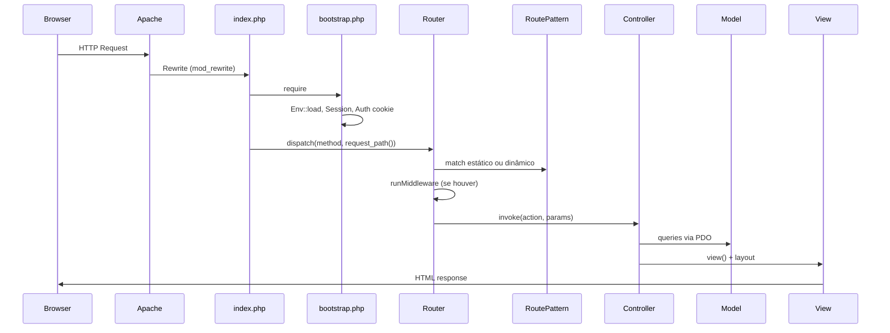

# PROJECT_ARCHITECTURE.md — Indique e Ganhe

**Empresa:** Drogaria e Perfumaria Minas Mais  
**Stack:** PHP 8.1+, MySQL, MVC próprio (sem framework)  
**Hospedagem alvo:** Hostinger  
**Domínio alvo:** `https://indique.minasmaisdrogarias.com.br`  
**Data do diagnóstico:** 26/06/2026  
**Fase:** 0 — Diagnóstico (sem alterações de negócio)

---

## 1. Visão geral

Sistema de campanha **Indique e Ganhe** para indicação de clientes, com fluxo web completo (cadastro, login, dashboard, convite, indicações, admin, validação, cupons) e preparação estrutural para integrações externas (AppsFlyer, VTEX, KOBE).

O projeto evoluiu em **16 etapas incrementais**, resultando em camadas parcialmente consolidadas e alguns fluxos paralelos/legados coexistindo.

---

## 2. Estrutura de diretórios

```
/
├── index.php              # Front controller principal
├── server.php             # Dev server (PHP built-in)
├── .htaccess              # Rewrite + proteção .env e pastas internas
├── .env / .env.example    # Variáveis de ambiente
│
├── config/
│   ├── bootstrap.php      # Boot: requires, sessão, exception handler
│   ├── app.php            # Config da aplicação (Env)
│   ├── database.php       # Classe Database (PDO singleton)
│   ├── router.php         # Instancia Router + carrega routes
│   ├── routes.php         # Definição de rotas (~50 rotas)
│   └── appsflyer.php      # Config AppsFlyer (stub)
│
├── core/                  # Núcleo MVC e infraestrutura
│   ├── Router.php
│   ├── RoutePattern.php   # Compilação de placeholders {id}, {slug}, etc.
│   ├── Controller.php
│   ├── Model.php
│   ├── Auth.php / AuthMiddleware.php
│   ├── Session.php / Csrf.php
│   ├── Validator.php / RateLimiter.php
│   ├── Logger.php / EventLogger.php
│   ├── ReferralService.php
│   └── helpers.php        # url(), asset(), base_path(), request_path()
│
├── controllers/           # 17 controllers
├── models/                # 17 models
├── views/                 # 36 views + layouts + partials
├── components/            # Header (PHP + view)
├── services/              # 15 services (validação, cupons, AppsFlyer, VTEX stubs)
├── repositories/          # 2 repositories (AppsFlyer, Cupom)
├── enums/                 # AppsFlyerStatus, InstallType
├── middleware/            # ApiAuth (não carregado no bootstrap)
│
├── assets/
│   ├── css/style.css      # Design system Minas Mais (mobile-first)
│   ├── js/                # app.js, auth.js, dashboard.js, components.js
│   └── images/
│
├── database/              # 19 scripts SQL (migrations por etapa)
├── uploads/logs/          # app.log (protegido por .htaccess)
├── admin/index.php        # Stub 503 (legado — admin real via /admin rotas)
├── api/index.php          # Stub JSON (legado — API real via routes.php)
└── docs/                  # appsflyer-integration.md, api-kobe.md
```

---

## 3. Fluxo de requisição



### Boot sequence (`config/bootstrap.php`)

1. Define `BASE_PATH`
2. Carrega `.env` via `Env::load()`
3. `require_once` manual de ~20 classes core/models (sem autoloader PSR-4)
4. Carrega `config/app.php` e configura error reporting
5. `Session::start()` + `Auth::attemptFromRememberCookie()`

### Roteamento (Fase 1.2)

- Entrada: `index.php` → `config/router.php` → `config/routes.php`
- **Estáticas:** match exato por string (prioridade máxima)
- **Dinâmicas:** placeholders `{id}`, `{slug}`, `{codigo}`, `{uuid}` compilados em `RoutePattern`
- Prioridade entre dinâmicas: mais segmentos literais primeiro (ex.: `/admin/campanhas/criar` antes de padrões genéricos)
- Parâmetros injetados via `ReflectionMethod` com cast automático (`int`, `float`, `bool`)
- Métodos HTTP: `GET`, `POST`, `PUT`, `DELETE`
- Middleware de rota: 4º argumento opcional em `get()`/`post()`/`put()`/`delete()`; carregado de `middleware/{Class}.php`
- Diagnóstico: `Router::resolve($method, $path)` retorna controller, action, middleware e params sem executar

```mermaid
flowchart TD
    A[HTTP Request] --> B[normalizePath]
    B --> C{Match estático?}
    C -->|Sim| F[runMiddleware]
    C -->|Não| D[RoutePattern::match]
    D --> E{Match dinâmico?}
    E -->|Não| G[404]
    E -->|Sim| F
    F --> H[invoke com params]
    H --> I[Controller@action]
```

| Placeholder | Validação |
|-------------|-----------|
| `{id}` | `\d+` |
| `{slug}` | kebab-case |
| `{codigo}` | alfanumérico |
| `{uuid}` | UUID v4 |

**Auth/Admin/CSRF** continuam nos controllers (não são middleware de rota). **ApiAuth** é middleware de rota na API KOBE.

### Helpers de URL

| Função | Propósito |
|--------|-----------|
| `url($path)` | Monta URL absoluta usando `APP_URL` ou `base_path()` |
| `asset($path)` | URL para `/assets/...` |
| `base_path()` | Detecta subpasta ou `APP_BASE_PATH` |
| `request_path()` | Normaliza URI para roteamento |

**Importante:** Links de convite são gerados via `ReferralService::inviteLink()` e `LinkIndicacao::createForUser()` usando `url()`. URLs também são **persistidas** na coluna `links_indicacao.url` no momento da criação.

---

## 4. Camadas arquiteturais

### 4.1 MVC

| Camada | Responsabilidade | Padrão |
|--------|------------------|--------|
| **Controller** | HTTP, validação de entrada, redirect, view | 17 classes estendem `Controller` |
| **Model** | Acesso a dados (PDO prepared statements) | 17 classes estendem `Model` |
| **View** | Templates PHP puro com layouts `main`, `app`, `admin` | Dot notation: `auth.login` → `views/auth/login.php` |

### 4.2 Services

Lógica de negócio mais complexa extraída parcialmente:

- `ReferralService` — códigos, sessão de ref, compartilhamento
- `ValidationService` — motor de validação admin
- `CupomService` — geração/gestão de cupons
- `AppsFlyerService` — ingestão de eventos (preparação)
- Providers (interfaces): `ValidationProviderInterface`, `CouponProviderInterface`, `NotificationProviderInterface`
  - Implementações internas: `InternalCouponProvider`, `AppsFlyerValidationProvider` (stub)
  - Stubs externos: `VTEXValidationProvider`, `VTEXCouponProvider`, `WhatsAppNotificationProvider`

### 4.3 Repository Pattern (parcial)

Apenas 2 repositories:

- `AppsFlyerRepository`
- `CupomRepository`

Demais models acessam PDO diretamente.

### 4.4 Event Logging (dual)

| Sistema | Tabela | Classe |
|---------|--------|--------|
| Eventos gerais | `eventos` | `Evento` + `EventLogger` |
| Eventos de indicação (legado) | `eventos_indicacao` | `EventoIndicacao` |

### 4.5 Middleware

| Middleware | Uso previsto | Status |
|------------|--------------|--------|
| `AuthMiddleware` | `requireAuth()` / `requireGuest()` — chamada manual nos controllers | ✅ Ativo |
| `ApiAuth` | Bearer token na API KOBE | ✅ Middleware de rota (Fase 1.2) |

---

## 5. Mapa de controllers e rotas

### Autenticação e usuário

| Rota | Controller | Ação |
|------|------------|------|
| GET/POST `/cadastro` | AuthController | registerForm / register |
| GET/POST `/login` | AuthController | loginForm / login |
| POST `/logout` | AuthController | logout |
| GET/POST `/esqueci-senha` | AuthController | forgotForm / forgot |
| GET/POST `/redefinir-senha` | AuthController | resetForm / reset |
| GET/POST `/perfil` | ProfileController | index / update |
| POST `/perfil/senha` | ProfileController | changePassword |
| POST `/perfil/excluir` | ProfileController | delete |

### Indicação e convite

| Rota | Controller | Ação |
|------|------------|------|
| GET `/convite` | ConviteController | index (fluxo principal web) |
| POST `/convite/participar` | ConviteController | participar |
| POST `/participar` | IndicadosController | participar (fluxo alternativo) |
| GET `/cadastro-indicado` | IndicadosController | cadastro |
| POST `/salvar-indicado` | IndicadosController | salvar |
| GET `/finalizado` | IndicadosController | finalizado |
| GET `/dashboard` | DashboardController | index |
| POST `/dashboard/compartilhar` | DashboardController | share |
| GET `/indicacoes` | IndicacoesController | index |

### Admin

| Rota | Controller | Observação |
|------|------------|------------|
| GET `/admin` | AdminController | Dashboard admin |
| GET `/admin/usuarios` | AdminController | |
| GET `/admin/campanhas` | AdminController + CampanhasController | Duplicidade |
| GET `/admin/validacoes` | ValidacaoController | |
| GET `/admin/validacoes/{id}` | ValidacaoController | ✅ Params `{id}` |
| GET `/admin/cupons` | CuponsController | |
| GET `/admin/appsflyer` | AppsFlyerController | |
| CRUD `/admin/campanhas/*` | CampanhasController | ✅ Rotas `{id}` funcionais |

### API

| Rota | Controller | Middleware |
|------|------------|------------|
| POST `/api/indicacao/confirmar-cadastro` | ApiIndicacaoController | ApiAuth (quebrado) |

### Controllers sem rota dedicada

- `IndicadosController::index()` — **sem rota registrada** (código morto ou incompleto)
- `ErrorController::notFound()` — registrado em `/404`
- `HomeController` — `/`

---

## 6. Fluxos de negócio

### 6.1 Login

1. GET `/login` → formulário
2. POST com CSRF + rate limit (`login_tentativas`)
3. `Usuario::findByLogin()` + `password_verify()`
4. Verifica `ativo` (soft delete)
5. `Auth::login()` com opção remember-me (cookie `indique_remember`, token SHA-256)
6. `EventLogger::logLogin()` → redirect `/dashboard`

### 6.2 Cadastro (indicador)

1. Opcional: ref em sessão via `/convite?ref=MMXXXXXX`
2. Validação CPF, telefone, email, senha (8+ chars, letra+número)
3. Gera `codigo_indicador` (formato `MM` + 6 chars)
4. `ReferralService::attachRegistrationToReferral()` vincula indicação
5. Auto-login → `/dashboard`

### 6.3 Sessão

- Nome: `SESSION_NAME` (default `indique_session`)
- Cookie: httponly, samesite=Lax, secure auto em HTTPS
- Regeneração de ID no login
- Remember-me: 30 dias

### 6.4 Dashboard

- Stats de `indicados` (primário) + `indicacoes` (legado)
- Cria `links_indicacao` se não existir
- Compartilhamento via POST `/dashboard/compartilhar`
- Layout `app` com bottom-nav mobile

### 6.5 Convite (fluxo web — ConviteController)

1. GET `/convite?ref=CODIGO`
2. Valida link ativo em `links_indicacao`
3. Anti-spam/duplicata via `cliques`
4. `ReferralService::handleLinkAccess()` → sessão + registro em `indicacoes`
5. Redirect para cadastro via POST participar

### 6.6 Convite alternativo (IndicadosController)

Fluxo paralelo com views em `views/indicados/` — parcialmente implementado, com bugs de Validator/RateLimiter (ver BUG_TRACKER).

### 6.7 Admin

- Autorização: email hardcoded `admin@minasmais.com.br` (`AdminController::ADMIN_EMAIL`)
- Duplicado em 5 controllers (`requireAdmin()` privado em cada)
- Sem RBAC, sem tabela de roles

### 6.8 Validação e cupons

- `ValidationService` orquestra validação manual admin
- Aprovação pode disparar `CupomService::generateForIndicacao()`
- Provider pattern preparado para VTEX/AppsFlyer (stubs)

---

## 7. Configuração e ambiente

### Variáveis principais (`.env`)

| Variável | Uso |
|----------|-----|
| `APP_URL` | URL base absoluta (links, redirects, convites) |
| `APP_BASE_PATH` | Subpasta opcional |
| `APP_DEBUG` | Erros visíveis |
| `SESSION_SECURE` | Cookie secure forçado |
| `DB_HOST`, `DB_PORT`, `DB_DATABASE`, `DB_USERNAME`, `DB_PASSWORD` | Conexão MySQL |
| `API_TOKEN` | Autenticação API KOBE |

### Estado atual vs. alvo (migração)

| Item | Atual (diagnóstico) | Alvo |
|------|---------------------|------|
| `APP_URL` | `https://indique.minasmaisdrogarias.com.br` | ✅ Migrado (Fase 1.1) |
| Banco | `u146248277_indicacao` / `u146248277_indiqueganhe` | ✅ Configurado no `.env` |
| Host | localhost:3306 | localhost:3306 |

### Checklist de migração de domínio (Fase 1)

1. Atualizar `.env`: `APP_URL=https://indique.minasmaisdrogarias.com.br`
2. Garantir `APP_BASE_PATH=` vazio (subdomínio na raiz do `public_html`)
3. Definir `APP_DEBUG=false`, `SESSION_SECURE=true` em produção
4. Atualizar credenciais DB no `.env` (senha apenas no servidor)
5. Executar SQL para atualizar URLs persistidas:
   ```sql
   UPDATE links_indicacao
   SET url = REPLACE(url, 'indique.nexden.com.br', 'indique.minasmaisdrogarias.com.br');
   ```
6. Atualizar `README.md` (referências nexden)
7. Verificar links de reset de senha (`AuthController` usa `url()` — OK após APP_URL)
8. **Não** alterar footer "NEXDEN Digital" (branding dev — decisão de produto)

### Arquivos com referência ao domínio antigo

| Arquivo | Tipo |
|---------|------|
| `.env` | Config ativa |
| `README.md` | Documentação |
| `CHECKLIST_ETAPA3.md`, `CHECKLIST_ETAPA5.md` | Checklists históricos |
| `links_indicacao.url` (banco) | Dados persistidos |

Código de aplicação usa `url()` / `Env::get('APP_URL')` — **sem hardcode de domínio no PHP de runtime** (exceto dados já gravados no banco).

---

## 8. Autoload e dependências

- **Sem Composer** / sem `vendor/`
- Bootstrap carrega ~20 arquivos via `require_once`
- Services, repositories, enums e middleware **não** estão no bootstrap — carregados sob demanda nos controllers que os instanciam (ou falham se não existirem)
- Controllers avançados (Validacao, Cupons, AppsFlyer, ApiIndicacao) fazem `require` implícito via autoload inexistente → dependem de serem carregados manualmente ou causam fatal error

---

## 9. Assets e UX

- CSS mobile-first (base 390px), design system Minas Mais (#D71920)
- Layouts: `main` (público), `app` (logado + bottom-nav), `admin`
- JS: copy/share nativo no dashboard, máscaras em auth.js
- Responsivo com breakpoints desktop para header e container max 480px
- Logo: `assets/images/Logo - Drogaria e Perfumaria.png` ou placeholder SVG

---

## 10. Integrações — estado arquitetural

| Integração | Preparação estrutural | Implementação |
|------------|----------------------|---------------|
| **AppsFlyer** | Tabela, services, admin UI, config, docs | Webhook/API real não conectada; `enabled=false` |
| **VTEX** | Provider interfaces + stubs | `isAvailable()=false`; sem credenciais |
| **KOBE** | API endpoint + docs + ApiLog | Controller implementado; auth middleware quebrado; model incompatível |

---

## 11. Qualidade arquitetural — síntese

**Pontos fortes:**
- MVC claro e legível para equipe PHP
- PDO com prepared statements predominante
- CSRF, rate limit login, sessão segura
- `.htaccess` protege pastas sensíveis
- Provider pattern para extensibilidade futura
- Event logging estruturado

**Pontos fracos:**
- Bootstrap incompleto (sem autoload)
- Duplicação: fluxos convite, eventos, validações, campanhas (migrations conflitantes)
- `requireAdmin()` duplicado em 5 controllers
- Stubs de integração com bugs de tipo (VTEXCouponProvider)
- Entradas legadas `admin/index.php` e `api/index.php` (503/stub)

**Classificação:** Arquitetura **moderada/boa para MVP**, com **dívida técnica significativa** nas etapas 12–16 que precisa consolidação antes de produção plena.
